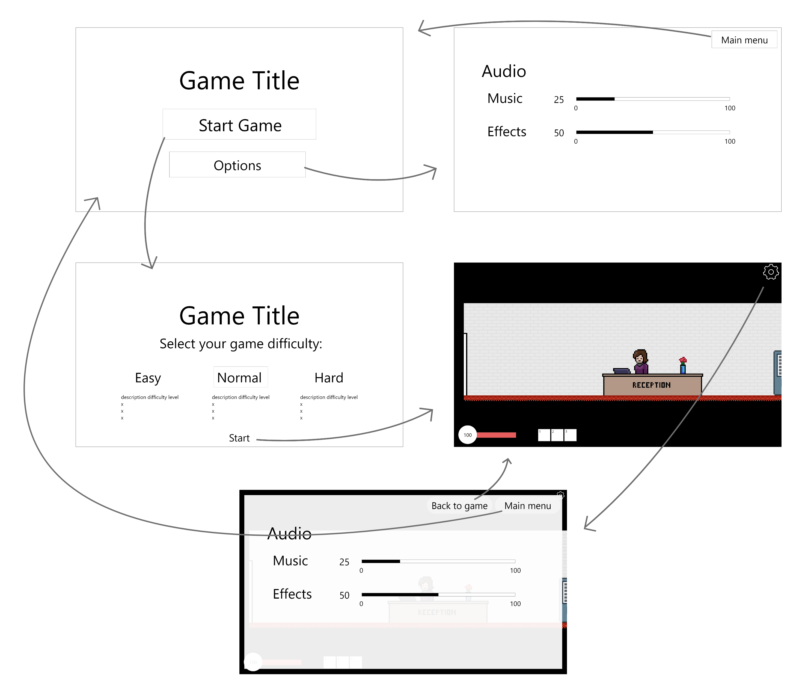

# Startdocument

Development team:

| Name             | Student Number |
| ---------------- | -------------- |
| Stefan Untura    | **4839161**    |
| Victor Tromp     | **4922972**    |
| Line Amini Kaveh | **4929284**    |
| Josta Holsappel  | **4785428**    |

## Game Concept

xx

## Screens/Sketches

## Schedule

| Week |                                                              | Time   |
| ---- | ------------------------------------------------------------ | ------ |
| 1    | Goal: getting familiar with tools, work on concept, research |        |
|      | Class/Tutorial                                               | 0,75 h |
|      | Group meeting                                                | 3 h    |
|      | Individual work hours                                        | 5 h    |
|      |                                                              |        |
| 2    | Goal: continue research, layout all necessary features needed to realize concept |        |
|      | Class/Tutorial                                               | 1,5 h  |
|      | Group meeting                                                | 1 h    |
|      | Individual work hours                                        | 7 h    |
|      |                                                              |        |
| 3    | Goal: work on game                                           |        |
|      | Class/Tutorial                                               | 1,5 h  |
|      | Group meeting                                                | 1 h    |
|      | Individual work hours                                        | 7 h    |
|      |                                                              |        |
| 4    | Goal: prep interim showcase, continue game                   |        |
|      | Class/Tutorial                                               | 1,5 h  |
|      | Group meeting                                                | 3 h    |
|      | Individual work hours                                        | 5 h    |
|      |                                                              |        |
| 5    | Goal: work on game                                           |        |
|      | Class/Tutorial                                               | 1,5 h  |
|      | Group meeting                                                | 2 h    |
|      | Individual work hours                                        | 5 h    |
|      |                                                              |        |
| 6    | Goal: work on game                                           |        |
|      | Class/Tutorial                                               | 1,5 h  |
|      | Group meeting                                                | 1 h    |
|      | Individual work hours                                        | 7 h    |
|      |                                                              |        |
| 7    | Goal: work on game                                           |        |
|      | Class/Tutorial                                               | 1,5 h  |
|      | Group meeting                                                | 1 h    |
|      | Individual work hours                                        | 7 h    |
|      |                                                              |        |
| 8    | Goal: work on finalizing game                                |        |
|      | Class/Tutorial                                               | 1,5 h  |
|      | Group meeting                                                | 3 h    |
|      | Individual work hours                                        | 5 h    |
|      |                                                              |        |
| 9    | Goal: finalize game, prep presentation                       |        |
|      | Class/Tutorial                                               | 1,5 h  |
|      | Group meeting                                                | 3 h    |
|      | Individual work hours                                        | 5 h    |

## Literature

xx